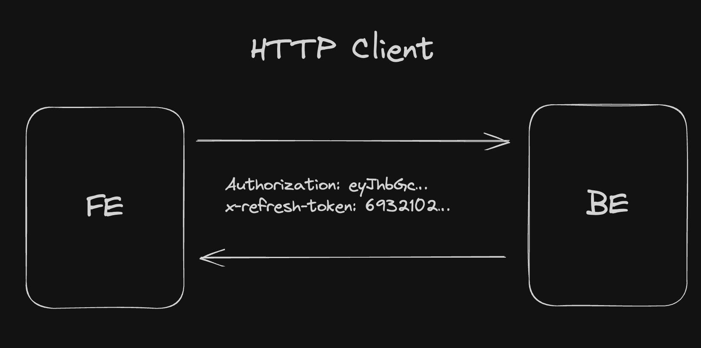

# HTTP client with token refresh

This HTTP client is designed to handle authentication using access and refresh tokens. It ensures seamless request
execution by managing token expiration and refresh mechanisms.

## Concept

The concept is pretty simple: you have a request queue that is filled with configs and then executed.
The access token expiration is checked before the actual request, so we can refresh it if needed.
When the refresh is needed, the queue is paused until the new access token is retrieved.
After that, the queue is resumed and all the requests are executed with the maintained concurrency.

The testing is done with [msw](https://mswjs.io/docs/getting-started/integrate/node) to mock the API and sqlite DB to
store the data.

## Requirements

- JWT token should contain `exp` claim
